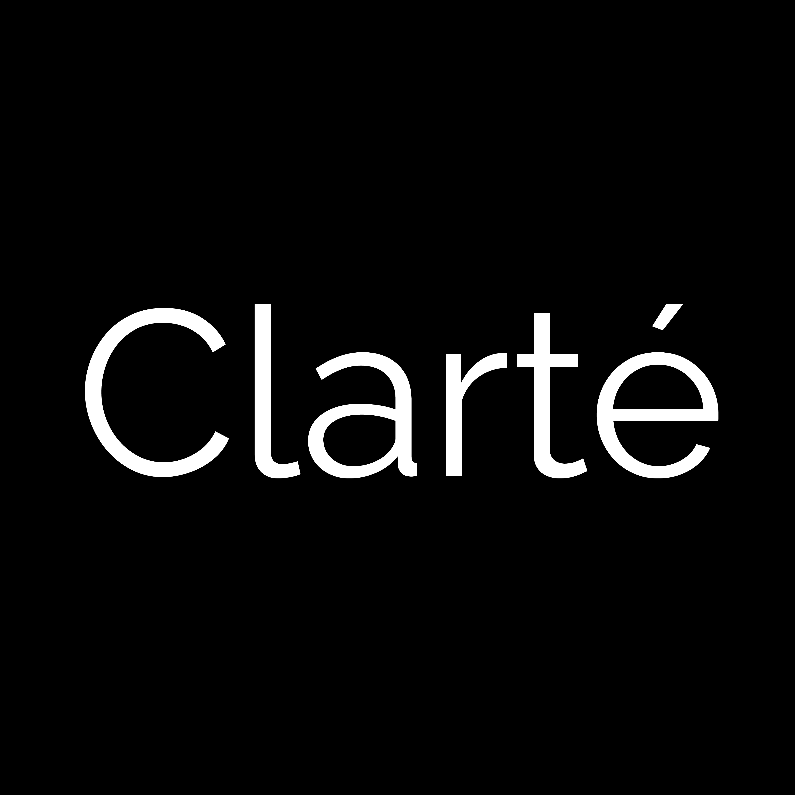

    

 
 

<a href="https://clarteresearch.com" style="margin-bottom: 50px"> 

 
</a>

- Hi, I’m Aditya Rawat. 
- I’m passionate about building impactful and scalable technology solutions. 
- Currently deepening my expertise in AI and product design. 
- Open to collaborating on web and mobile development projects. 
- You can reach me at <a href="mailto:aditya@clarteresearch.com"><b>aditya@clarteresearch.com</b></a> 

 

<h2>Tech Stack</h2>
<!--tech stack icons-->

  

 

